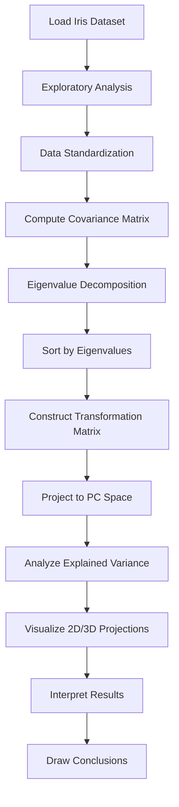

# Principal Component Analysis on Iris Dataset

## 📋 Assignment Information

**Course:** Artificial Intelligence II  
**Assignment:** Assignment 3 - Principal Components Analysis  
**Lecturer:** Dr Andrés Hernández Gutiérrez  
**Due Date:** Monday 16 February 2026, 11:59pm  

## 🎯 Objectives

This project demonstrates a complete implementation of Principal Component Analysis (PCA) for feature dimensionality reduction and data visualization using the classic Iris flower dataset. The assignment focuses on:

- Understanding the mathematical foundations of PCA
- Implementing PCA step-by-step from scratch
- Interpreting covariance matrices, eigenvalues, and eigenvectors
- Visualizing high-dimensional data in reduced dimensions
- Preparing features for neural network architectures

## 📊 Dataset

**Dataset Name:** Iris Flower Dataset  
**Source:** UCI Machine Learning Repository / Scikit-learn  
**Link:** https://archive.ics.uci.edu/ml/datasets/iris

### Dataset Characteristics
- **Instances:** 150 (50 per species)
- **Features:** 4 numerical features
  - Sepal Length (cm)
  - Sepal Width (cm)
  - Petal Length (cm)
  - Petal Width (cm)
- **Target:** 3 species classes
  - Iris Setosa
  - Iris Versicolor
  - Iris Virginica
- **Task Type:** Multi-class classification
- **Application Domain:** Botany and Pattern Recognition

## 🔬 Methodology

### 1. Exploratory Data Analysis
- Data cleaning and quality verification
- Summary statistics
- Feature distribution analysis
- Correlation analysis
- Visualization (histograms, pairplots, boxplots, heatmaps)

### 2. Principal Component Analysis Implementation
- **Data Standardization:** Zero mean and unit variance transformation
- **Covariance Matrix:** Computation and interpretation
- **Eigenvalue Decomposition:** Computing eigenvalues and eigenvectors
- **Transformation Matrix:** Constructing the loading matrix
- **Variance Analysis:** Explained variance and cumulative variance
- **Dimensionality Reduction:** Projecting to 2D and 3D spaces

### 3. Visualization
- 3D scatter plots from multiple viewing angles
- 2D PCA projection with density contours
- Biplot (scores + loadings)
- Scree plot and variance charts
- Decision boundary visualization
- Centroid analysis

## 📈 Key Results

| Principal Component | Eigenvalue | Variance Explained | Cumulative Variance |
|---------------------|------------|-------------------|---------------------|
| PC1                 | 2.92       | 72.96%            | 72.96%              |
| PC2                 | 0.92       | 22.85%            | 95.81%              |
| PC3                 | 0.15       | 3.67%             | 99.48%              |
| PC4                 | 0.02       | 0.52%             | 100.00%             |

### Main Findings
- **Optimal Dimensionality:** 2 principal components retain **95.81%** of variance
- **Class Separation:** Iris Setosa is perfectly separable; Versicolor and Virginica show some overlap
- **Feature Importance:** Petal measurements contribute most to PC1 (primary discriminative axis)
- **Suitability for ML:** The reduced 2D space is ideal for neural network classification

## 🛠️ Technologies & Libraries

```python
# Core Libraries
import numpy as np              # Numerical computation
import pandas as pd             # Data manipulation
import matplotlib.pyplot as plt # Visualization
import seaborn as sns           # Statistical visualization

# Machine Learning
from sklearn.datasets import load_iris
from sklearn.preprocessing import StandardScaler
from scipy.spatial.distance import pdist, squareform
from scipy import stats
```

### Requirements
- Python 3.8+
- NumPy 1.21+
- Pandas 1.3+
- Matplotlib 3.4+
- Seaborn 0.11+
- Scikit-learn 1.0+
- SciPy 1.7+

## 🚀 Getting Started

### Installation

1. Clone this repository:
```bash
git clone https://github.com/perofficial/02-Principal-Component-Analysis.git
cd 02-Principal-Component-Analysis
```

2. Install required packages:
```bash
pip install numpy pandas matplotlib seaborn scikit-learn scipy
```

Or
```bash
pip install -r requirements.txt
```

### Running the Notebook

#### Option 1: Google Colab (Recommended)
1. Upload the notebook to Google Drive
2. Open with Google Colab
3. Run all cells sequentially

#### Option 2: Local Jupyter
```bash
jupyter notebook 02-Principal-Component-Analysis.ipynb
```

#### Option 3: JupyterLab
```bash
jupyter lab
```

### Expected Output
- Comprehensive exploratory data analysis with visualizations
- Step-by-step PCA implementation with mathematical explanations
- Multiple 2D and 3D visualizations of reduced data
- Statistical analysis tables and charts
- Detailed interpretations of all results

## 📁 Repository Structure

```
02-Principal-Component-Analysis/
│
├── 02-Principal-Component-Analysis.ipynb   # Main Jupyter notebook
├── README.md                               # This file
└── requirements.txt                        # libraries needed
```

## 📊 Visualizations

The notebook generates the following types of visualizations:

### Exploratory Analysis
- Feature distribution histograms
- Pairwise scatter plot matrix
- Correlation heatmap
- Box plots by species

### PCA Analysis
- Covariance matrix heatmap
- Eigenvalue bar chart
- Scree plot
- Cumulative variance plot
- Variance distribution pie chart

### Reduced Space Visualization
- 3D scatter plots (4 different viewing angles)
- 2D projections (PC1 vs PC2, PC1 vs PC3, PC2 vs PC3)
- Biplot with loading vectors
- Density contours
- Centroid analysis with inter-centroid distances

## 🔍 Key Concepts Demonstrated

### Mathematical Concepts
- Standardization (z-score normalization)
- Covariance and correlation
- Eigenvalue decomposition
- Linear transformations
- Variance maximization

### Machine Learning Concepts
- Dimensionality reduction
- Feature engineering
- Data preprocessing
- Unsupervised learning
- Data visualization

### Implementation Skills
- NumPy array operations
- Matrix computations
- Data manipulation with Pandas
- Advanced visualization with Matplotlib/Seaborn
- Jupyter notebook best practices
  

## 🔄 Workflow Summary



## 🎯 Future Work & Extensions

This analysis provides a foundation for:

1. **Neural Network Implementation**
   - Use 2D PCA features as input
   - Build feedforward network for classification
   - Compare performance: PCA features vs original features

2. **Alternative Techniques**
   - Linear Discriminant Analysis (LDA)
   - t-SNE for non-linear dimensionality reduction
   - Autoencoders for deep feature learning

3. **Advanced Analysis**
   - Kernel PCA for non-linear patterns
   - Incremental PCA for large datasets
   - Sparse PCA for interpretability

4. **Model Comparison**
   - SVM with PCA features
   - Random Forest feature importance vs PCA loadings
   - Deep learning architectures

## 📚 References

### Dataset
1. Fisher, R.A. (1936). "The use of multiple measurements in taxonomic problems". *Annals of Eugenics*, 7(2), 179-188.
2. UCI Machine Learning Repository: https://archive.ics.uci.edu/ml/datasets/iris

### PCA Theory
3. Jolliffe, I.T. (2002). *Principal Component Analysis* (2nd ed.). Springer.
4. Abdi, H. & Williams, L.J. (2010). "Principal component analysis". *WIREs Computational Statistics*, 2(4), 433-459.
5. Shlens, J. (2014). "A Tutorial on Principal Component Analysis". arXiv:1404.1100

### Python Libraries
6. Pedregosa et al. (2011). "Scikit-learn: Machine Learning in Python". *JMLR*, 12, 2825-2830.
7. McKinney, W. (2010). "Data Structures for Statistical Computing in Python". *SciPy*.
8. Harris et al. (2020). "Array programming with NumPy". *Nature*, 585, 357-362.

## 👤 Author

**Matteo Peroni**   
**Course:** Artificial Intelligence II  
**Institution:** UDEM - Monterrey 
**Date:** February 2026

## 📧 Contact

For questions or feedback about this project:
- Email: [matteoperoni.work@gmail.com]
- GitHub: [@perofficial](https://github.com/perofficial)

## 📄 License

This project is created for educational purposes as part of the Artificial Intelligence II course assignment.

---

## 🙏 Acknowledgments

- Dr Andrés Hernández Gutiérrez for the comprehensive assignment guidelines

---

## ⭐ If you find this helpful, please star this repository!

---

*Last Updated: February 14, 2026*
